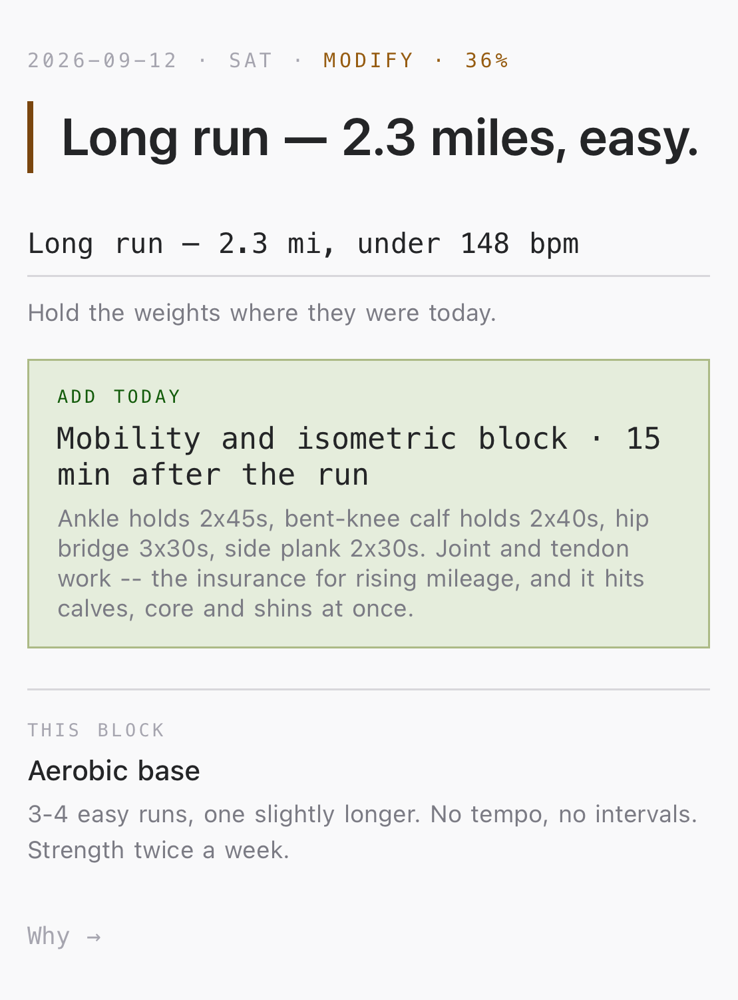
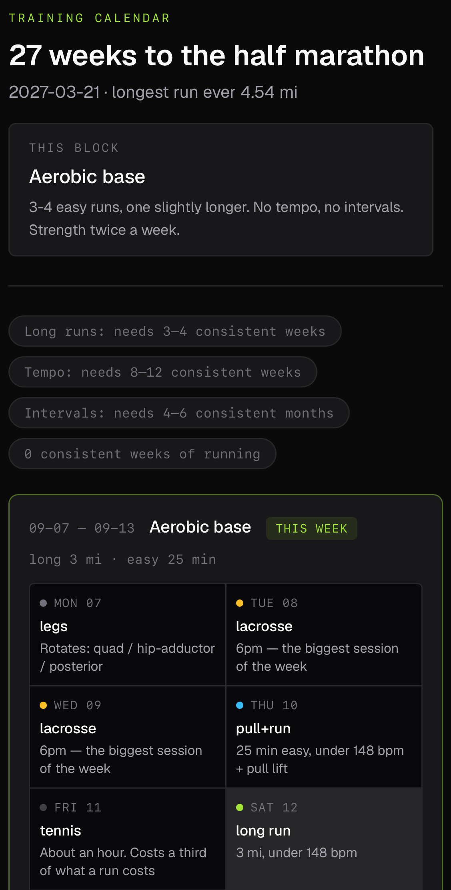
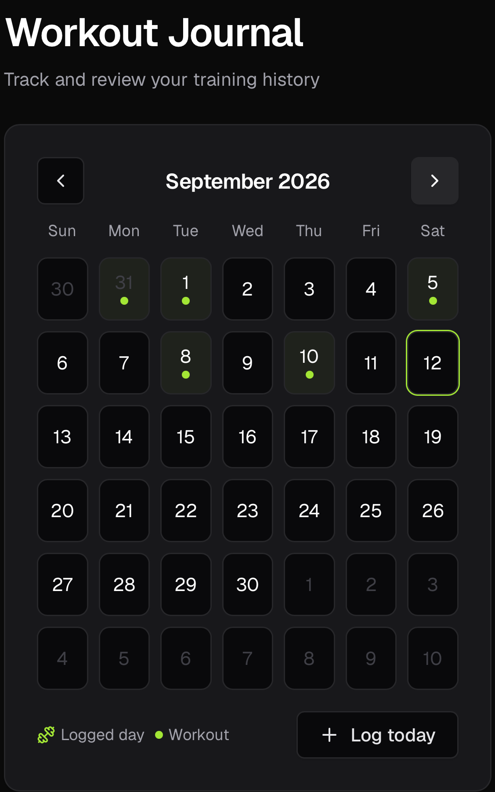

# Fitness Optimizer

A training app that reads WHOOP recovery data each morning and emails one
specific prescription for the day: what to train, how hard, and at what loads.

**Live:** https://fitness-optimizer.vercel.app
**Stack:** Next.js 16 (App Router, React 19 Server Components) · TypeScript ·
Supabase (Postgres + Auth + RLS) · Tailwind + shadcn/ui · Vercel · WHOOP API ·
Anthropic API

<p>
  
  
  
</p>

## What it does

Two halves that share a database.

**The app.** Sign up, complete a three-step profile (goal, experience,
equipment), and get a generated weekly plan. `analyzeRoutine()` computes weekly
set volume per muscle (primary muscles count as a full set, secondary as half),
detects push/pull and upper/lower imbalances, and ranks them by severity. The
plan generator picks a split from available days and goal (for strength: 3 days
→ PPL, 4 → Upper/Lower ×2, 5 → PPL plus Upper/Lower; cardio and weight-loss
goals mix in conditioning days), filters the exercise library by owned
equipment, weights selection toward the muscles flagged as underworked, and
prescribes volume by experience level. Workouts are logged on a calendar, or
pasted in as free text and parsed.

**The morning decision.** A scheduled job hits `/api/morning`, which pulls last
night's WHOOP recovery, sleep and strain, combines it with the training history,
and emails a single decision: train or back off, which session, which exercises,
and what weight for each based on the last time that lift was performed. The
engine (`lib/athlete/decide.ts`) is a pure function. Records and config in, a
decision out, no fetching and no rendering, so it can be tested and read on its
own.

## Engineering notes

The parts of this that took real thought.

**The scheduler had to be moved, twice, for a measurable reason.** WHOOP scores
recovery a median of 13 minutes after wake, and wake time varies by hours, so a
fixed morning alarm is wrong most days. The job therefore polls a wide window
and sends only once recovery is actually scored, with the day's row in
`decision_log` doubling as the already-sent guard so repeated polls don't send
repeat emails. GitHub Actions was the first poller and turned out to fire 2 of
roughly 32 scheduled runs in its first 34 hours, because scheduled workflows on
free public repos are best-effort. The replacement is `pg_cron` inside
Postgres, a real scheduler, with the Actions workflow kept as a fallback until
the new job has proven itself. The reasoning is preserved in
`db/migrations/003_morning_cron.sql`.

**WHOOP rotates its refresh token on every use and invalidates the old one
immediately.** That makes concurrent refreshes a permanent lockout rather than a
retryable error, so only one code path may refresh, and it must persist the new
pair before using it. Tokens live in a single-row table with a check constraint
enforcing the singleton, and only the morning route refreshes them. The
local scripts that predate this are read-only now.

**Secrets and personal data stay out of a public repo.** The `athlete_*` tables
have RLS enabled with no policies at all, so the anon and publishable keys
cannot read them under any condition. Only the service role key can, and it
lives in Vercel's environment.

**The tunables are calibrated against data, and say so when the data is thin.**
Each activity carries a recovery cost estimated from the athlete's own history.
Where the sample is small the comment records the sample size, the standard
error, and what would change the number. The tennis cost, for example, is
documented as the weakest-evidenced value in the set, derived from seven clean
sessions with a next-day residual of -1.8 ± 5.9, which is statistically
indistinguishable from zero, and set conservatively for a stated reason.

**Recommendations trace to a source.** `lib/athlete/protocols.ts` holds the
external research separately from the engine. Every protocol carries the
finding, the number it implies, the citation, the search that found it, a
confidence level, and the date it was last reviewed, so any advice the app gives
can be traced to something other than an opinion.

## Architecture

```
app/
  api/morning/route.ts   the daily decision endpoint (auth'd by CRON_SECRET)
  onboarding/            three-step profile wizard
  plan/ plans/           AI plan generation, plan list and detail
  log-workout/           calendar logging and free-text paste parsing
  exercises/             searchable exercise library
lib/
  muscle-analysis.ts     volume per muscle, imbalance detection
  plan-generator.ts      split selection and exercise prescription
  athlete/
    decide.ts            the decision engine (pure)
    protocols.ts         cited research, dated and confidence-rated
    whoop.ts             WHOOP v2 client with correct token rotation
    parse-log.ts         free-text workout log parser
db/migrations/           schema, applied via the Supabase SQL editor
```

Data mutations are Server Actions rather than route handlers. Apart from
Supabase's auth-confirm callback, `/api/morning` is the only route handler,
because a scheduler needs a URL. Every user-facing table
uses RLS scoped to `auth.uid()`.

## Running locally

```bash
npm install
cp .env.example .env.local   # fill in the two Supabase values
npm run dev
```

```
NEXT_PUBLIC_SUPABASE_URL=
NEXT_PUBLIC_SUPABASE_PUBLISHABLE_KEY=
```

The app runs on those two alone. The morning decision additionally needs
`SUPABASE_SERVICE_ROLE_KEY`, `WHOOP_CLIENT_ID`, `WHOOP_CLIENT_SECRET`,
`RESEND_API_KEY`, `EMAIL_TO` and `CRON_SECRET`. Apply the files in
`db/migrations/` in order via the Supabase SQL editor.

`GET /api/morning?dry=1` runs the whole pipeline, sends nothing, and returns the
decision as JSON. That is the fastest way to see what the engine does.
